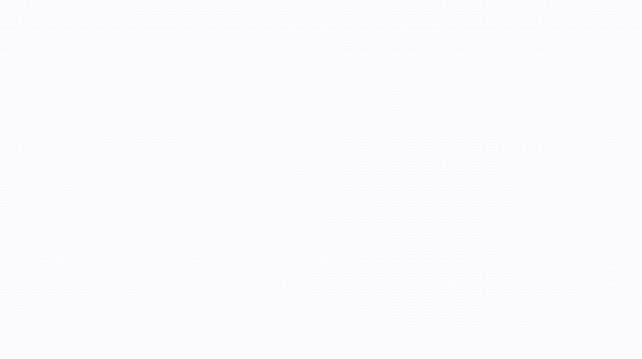

# Cattle Herd Manager

A small herd management app built with Next.js App Router and CSV-backed data storage.

## Overview

This app manages cattle records, breeding, health, finances, and settings. Data is stored locally using CSV files in the `data/` directory, and cattle images are served from `data/images/`.

## Prerequisites

- Node.js 20 or later
- npm (or `yarn` / `pnpm` if preferred)

## Install

```bash
npm install
```

## Run in development

```bash
npm run dev
```

Then visit:

```bash
http://localhost:9999
```

The app is configured to run on port `9999` in development.

## Build and start

```bash
npm run build
npm run start
```

## Useful scripts

```bash
npm run dev         # start development server on port 9999
npm run build       # build production app
npm run start       # start built app on port 9999
npm run lint        # run ESLint
```

## PM2 support

This repo also includes `pm2` helper scripts for running the app as a process manager:

```bash
npm run pm2:start
npm run pm2:stop
npm run pm2:restart
npm run pm2:logs
npm run pm2:status
```

## Local data files

The app uses the following local files:

- `data/cattle.csv`
- `data/breeding.csv`
- `data/health.csv`
- `data/finances.csv`
- `data/settings.json`
- `data/images/` for uploaded photos and certificate images

If these files do not exist yet, the app may create them or expect them to be present when importing data.

Important:

- Files under data/ are local runtime state for your environment.
- In normal development, avoid committing data/*.csv or data/settings.json changes unless you are intentionally updating shared seed/sample data.
- Before committing code-only changes, review git status to ensure local herd/finance/health data changes are not staged.

## Features

- Cattle record management
- Breeding records and estimated calving windows
- Health and finance tracking
- PDF export for cattle ownership certificates
- Image upload and file serving via API routes

## Feature walkthrough video

To view the app features visually, open:

- [cattle-manager-feature-video.webm](cattle-manager-feature-video.webm)

Or view the animated demo directly in the README:



## Notes

- The app uses `next dev -p 9999`, so the development server is intentionally configured on port `9999`.
- Uploaded images are served through the built-in image API under `/api/images/`.

## Storage backends

The app supports two storage backends, selected automatically at runtime:

- **Local (default):** CSV files under `data/` and images under `data/images/`.
  Used whenever the Google environment variables below are not set. Ideal for
  local development.
- **Google Sheets:** Used when the `GOOGLE_*` variables are set. Tabular data
  is stored in a Google Spreadsheet (one tab per category: `cattle`,
  `breeding`, `health`, `finances`, plus `settings`). This backend has no local
  filesystem dependency, so it works on serverless hosts like Vercel.
  **Note:** photo uploads are not available on this backend (service accounts
  have no Drive storage quota); cattle photos are only supported by the local
  backend.

See [.env.example](.env.example) for the required variables, and
[docs/google-sheets-setup.md](docs/google-sheets-setup.md) for a step-by-step
guide to obtaining them.

## Deploy to Vercel (Google Sheets)

Vercel has no persistent filesystem, so the Google Sheets backend is required
there.

### 1. Create a Google service account

1. Go to the [Google Cloud Console](https://console.cloud.google.com/) and
   create (or pick) a project.
2. Enable the **Google Sheets API** for the project.
3. Create a **Service Account** and add a **JSON key**. Download the key file.
4. Note the service account email (looks like
   `name@project.iam.gserviceaccount.com`).

### 2. Create the spreadsheet

1. Create a new Google Spreadsheet. Copy its ID from the URL
   (`https://docs.google.com/spreadsheets/d/<ID>/edit`).
2. **Share** the spreadsheet with the service account email (Editor access).
   This step is required — without it the app cannot read or write.

The app creates the needed tabs automatically on first write.

### 3. Configure environment variables

Set these in Vercel (Project → Settings → Environment Variables), matching
[.env.example](.env.example):

- `GOOGLE_SERVICE_ACCOUNT_EMAIL`
- `GOOGLE_PRIVATE_KEY` — paste the full key; keep `\n` escapes intact and wrap
  the value in quotes.
- `GOOGLE_SHEETS_SPREADSHEET_ID`

### 4. Deploy

Import the GitHub repo into Vercel and deploy. No special build settings are
needed — `next build` works as-is.

### 5. Migrate existing data (optional)

Your current data lives in `data/*.csv`. To move it into Google:

1. Run the app locally **without** the `GOOGLE_*` variables (local backend) and
   open **Settings → Export** to download a backup ZIP — or run
   `curl http://localhost:9999/api/export -o backup.zip`.
2. On the deployed app (Google backend), open **Settings → Import** and upload
   that ZIP. This writes all records to the spreadsheet. (Photos in the ZIP are
   skipped on the Google backend.)

### Caveats

- **Run a single instance.** The data model rewrites whole sheets, so multiple
  concurrent instances can clash. Keep one running replica.
- **Lock it down before exposing real data.** A built-in password gate is
  available — see [Password protection](#password-protection) below. Set
  `APP_PASSWORD` in Vercel to require a password on every page and API route.
- **API rate limits.** Google Sheets allows ~60 reads/min per user — ample for
  personal use, not for heavy traffic.
- **Back up regularly** using the built-in Export.

## Password protection

The app ships with an optional, server-enforced password gate so you can lock a
deployment down to just yourself.

- Set the `APP_PASSWORD` environment variable to **enable** the gate. When set,
  every page and API route requires authentication — there is no way to bypass
  it by navigating directly to a URL, because the check runs server-side before
  any page renders.
- Leave `APP_PASSWORD` **unset** to disable the gate entirely (handy for local
  development).

How it works:

1. Any unauthenticated request to a page is redirected to `/login`; API routes
   return `401`.
2. On `/login`, entering the correct password sets a signed, HttpOnly session
   cookie (an HMAC of the password — the password itself is never stored).
3. **Session expiration.** Sessions expire after **15 minutes** of issue time
   (not inactivity). When you have 2 minutes left, a confirmation dialog appears
   asking if you want to continue. Clicking "Continue" refreshes your session
   for another 15 minutes; clicking "Logout" ends the session immediately. If
   the session expires without action, you are redirected to the login screen.
4. Changing `APP_PASSWORD` invalidates all existing sessions automatically.
5. **Brute-force throttle.** After 5 failed attempts a client is locked out for
   5 minutes (the login screen shows a live countdown). This state is held in
   memory per server process, so it's best-effort on serverless/multi-instance
   hosts and resets on redeploy — treat it as a speed bump, not a replacement
   for a strong password.

> **Choose a strong password.** Because throttling is best-effort on Vercel, a
> long, random `APP_PASSWORD` (20+ characters) is your real protection against
> brute-force guessing.

To protect your Vercel deployment, add `APP_PASSWORD` under **Project →
Settings → Environment Variables** and redeploy.

## Deploy elsewhere

This app can also run on any host with a persistent disk (a VPS, Fly.io with a
volume, etc.) using the default local backend. Ensure the `data/` directory is
writable and persisted.
